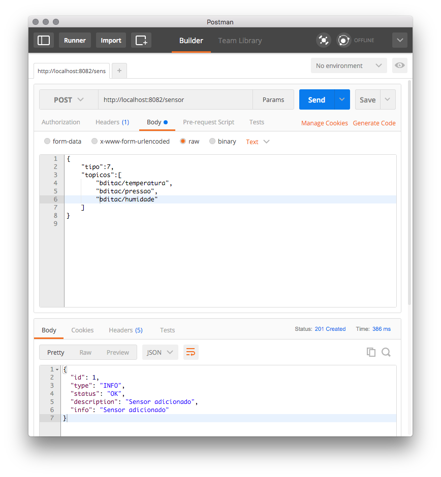
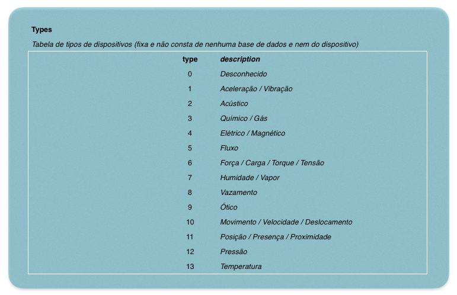

# Serviço MQTT de simulação de envio de sinais de sensores analógicos/digitais [BD-ITAC](https://sites.google.com/site/interdproj2016/)

Aplicação Mock usando [Spring Integration](http://projects.spring.io/spring-integration/) e [Spring Boot](http://projects.spring.io/spring-boot) para gerar um serviço MQTT que irá simular a emissão de sinais por sensores analógicos/digitais para a internet.

É um serviço muito simples que não persiste dados. Os dados recebidos ficam armazenados em memória até o sistema ser re-iniciado.

Para usar basta compilar e executar o jar do projeto. Após clonar o projeto no GitHub, execute diretamente na linha de comando:

    mvn clean
    mvn install
    java -jar target/MockSensorSimulator-0.0.1.jar

O Spring BOOT irá tentar conectar com um broker MQTT que poderá estar rodando na máquina local - recomendamos utilizar o [Mosquitto](http://mosquitto.org) ou poderá estar na internet (neste projeto utilizamos o tcp://iop.eclipse.org:1883).

Para gerar um simulador podemos executar um POST no endereço [http://localhost:8082/sensor](http://localhost:8082/sensor) com os dados do sensor no corpo da requisição:

```json
    {
        "tipo":7,
        "topicos":[
            "bditac/temperatura",
            "bditac/pressao",
            "bditac/humidade"
        ]
    }
```



## Tipos de sensores

Atualmente estão previstos os seguintes tipos de sensores:



## Docker

Também temos uma imagem [Docker](https://hub.docker.com/search/?isAutomated=0&isOfficial=0&page=1&pullCount=0&q=bditac&starCount=0) disponível para executar este serviço sem a necessidade de instalar, compilar e configurar coisa alguma exceto o próprio [Docker](http://www.docker.com).

    docker run -t -d -p 8082:8082 bditac/mocksensorsimulator:sp2

>Se você tentar usar o plugin maven do docker:
>
>    mvn docker:build -DpushImageTag
>    
>Ele irá:
>
>* Copiar os arquivos *src/main/docker/Dockerfile* e *target/MockAlerta-0.0.1.jar* para a pasta *target/docker*;
>* Executar **docker buil**;
>* Enviar a imagem para o Docker Hub
>

### Gerar imagem Docker

Para gerar uma imagem Docker basta executar a seguinte seqüência de comandos na janela do **Docker Quickstart Terminal**:

    mvn docker:build -DpushImageTag
    
>Aqui estamos deduzindo que você já tenha criado uma conta no site [Docker](https://www.docker.com) e também no [Hub Docker](https://hub.docker.com).

Pronto! Seus colegas poderão executar a sua versão com o seguinte comando (observar que aqui vai o ":devel"):

    docker run -d -p 8082:8082 <seu id no docker>/<seu repositório no docker hub>:devel
    
O Docker na máquina vai baixar a imagem e executá-la logo em seguida. Se ele for executar uma segunda vez basta repetir o comando: a imagem não será baixada novamente e o Docker vai usar o repositório local.
    